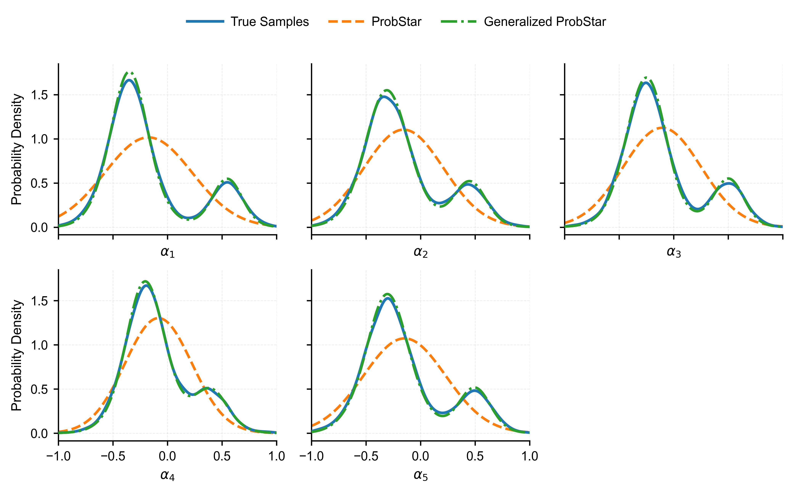
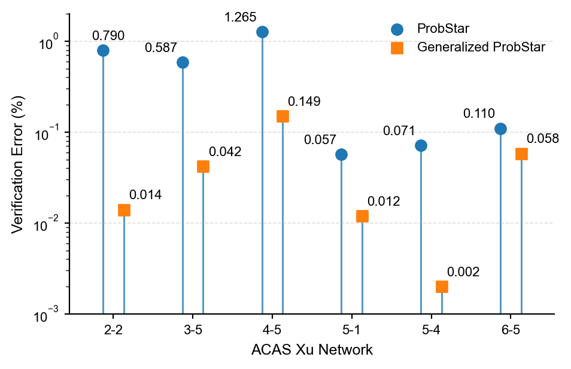

# Generalized ProbStar: Distribution-Aware Probabilistic Verification

This repository contains the experimental code for our work on
**Generalized ProbStar (GPS)**, a distribution-aware extension of ProbStar
for probabilistic neural-network verification under non-Gaussian and
multimodal input uncertainty.

The experiments use the **ACAS Xu** benchmark and compare three
predicate-distribution models:

- **True distribution:** a truncated two-component 5D Student-t mixture on
  $[-1,1]^5$.
- **ProbStar (PS):** a single truncated 5D Gaussian approximation.
- **Generalized ProbStar (GPS):** a truncated 10-component Gaussian mixture
  model (GMM) fitted using expectation-maximization (EM).

The experimental pipeline separates exact reachability from probability
computation:

```text
ACAS Xu network
      |
      v
Exact-Star propagation
      |
      v
Saved reachable Stars
      |
      v
Unsafe-region intersection
      |
      +------------------+------------------+
      |                  |                  |
      v                  v                  v
 True distribution    ProbStar          Generalized
 Student-t mixture    Gaussian           ProbStar GMM
      |                  |                  |
      +------------------+------------------+
                         |
                         v
        Unsafe probability / error / runtime / memory
```

## Repository Structure

### Distribution Modeling

| File | Description |
|---|---|
| `em_algorithm.py` | Generates samples from the true truncated Student-t mixture, fits the single-Gaussian ProbStar approximation and the 10-component GMM used by Generalized ProbStar, and evaluates distribution mismatch. |
| `distribution_mismatch.py` | Produces the marginal-distribution comparison used to visualize the mismatch between the true distribution, ProbStar, and Generalized ProbStar. |
| `distribution_marginals_3x2.png` | Marginal-density comparison for the five predicate variables. |
| `accuracy_result.py` | Generates the verification-error comparison figure for the selected Property-2 networks. |
| `accuracy.png` | Comparison of the absolute unsafe-probability errors of ProbStar and Generalized ProbStar. |

### ACAS Xu Reachability

| File | Description |
|---|---|
| `P2_propagation.py` | Exact-Star propagation for the six selected ACAS Xu Property-2 networks. |
| `P3_propagation.py` | Exact-Star propagation for the Property-3 ACAS Xu experiments. |
| `P4_propagation.py` | Exact-Star propagation for the Property-4 ACAS Xu experiments. |
| `ACASXU/` | ACAS Xu neural-network benchmark files used by the propagation scripts. |

The propagation stage is purely geometric. It propagates exact Stars through
the affine and ReLU layers and saves the resulting reachable Stars. No
probability distribution is required during this stage.

### Unsafe-Probability Computation

| File | Description |
|---|---|
| `P2_unsafe_compute.py` | Computes unsafe probabilities for the six selected Property-2 networks using the true, PS, and GPS predicate distributions. |
| `P3_unsafe_compute.py` | Computes Property-3 unsafe probabilities from saved exact reachable Stars. |
| `P4_unsafe_compute.py` | Computes Property-4 unsafe probabilities from saved exact reachable Stars. |

These scripts do **not** repeat network propagation. They load the saved
reachable Stars, intersect them with the corresponding unsafe output region,
and evaluate the probability under each of the three fixed predicate
distributions.

---

## Distribution Approximation Experiment

The ground-truth uncertainty model is a truncated two-component 5D Student-t
mixture. ProbStar approximates this distribution using a single Gaussian,
whereas Generalized ProbStar uses a **10-component GMM** fitted by EM.

For the reported fitting run:

| Quantity | Result |
|---|---:|
| Number of samples | 10,000 |
| GMM components | 10 |
| EM converged | Yes |
| EM iterations | 875 |
| ProbStar fitting time | 0.000340 s |
| ProbStar peak fitting memory | 0.445190 MB |
| Generalized ProbStar fitting time | 53.280812 s |
| Generalized ProbStar peak fitting memory | 5.187165 MB |

The complete distribution parameters used in the reported experiment are
provided below.

---

## Ground-Truth Distribution

The ground-truth distribution is a two-component truncated 5D Student-t
mixture on $[-1,1]^5$.

### Component 1

- **Weight:** `0.80000000`
- **Degrees of freedom:** `10`

**Mean**

```text
[-0.35, -0.30, -0.25, -0.20, -0.30]
```

**Scale matrix**

```text
[[0.0324, 0.0000, 0.0000, 0.0000, 0.0000],
 [0.0000, 0.0400, 0.0000, 0.0000, 0.0000],
 [0.0000, 0.0000, 0.0361, 0.0000, 0.0000],
 [0.0000, 0.0000, 0.0000, 0.0324, 0.0000],
 [0.0000, 0.0000, 0.0000, 0.0000, 0.0400]]
```

### Component 2

- **Weight:** `0.20000000`
- **Degrees of freedom:** `10`

**Mean**

```text
[0.55, 0.45, 0.50, 0.40, 0.50]
```

**Scale matrix**

```text
[[0.0196, 0.0000, 0.0000, 0.0000, 0.0000],
 [0.0000, 0.0225, 0.0000, 0.0000, 0.0000],
 [0.0000, 0.0000, 0.0196, 0.0000, 0.0000],
 [0.0000, 0.0000, 0.0000, 0.0256, 0.0000],
 [0.0000, 0.0000, 0.0000, 0.0000, 0.0225]]
```

**Normalization constant**

```text
Z_true = 0.9777465865
```

---

## ProbStar Approximation

The original ProbStar approximation uses a single truncated 5D Gaussian.

**Mean**

```text
[-0.17382733, -0.15508302, -0.10549723, -0.08245848, -0.14647688]
```

**Covariance matrix**

```text
[[0.16098538, 0.10517317, 0.10604200, 0.08393378, 0.11061816],
 [0.10517317, 0.13359542, 0.08901846, 0.07019068, 0.09347490],
 [0.10604200, 0.08901846, 0.12762315, 0.07053787, 0.09450510],
 [0.08393378, 0.07019068, 0.07053787, 0.09424588, 0.07321418],
 [0.11061816, 0.09347490, 0.09450510, 0.07321418, 0.14211245]]
```

**Normalization constant**

```text
Z_single = 0.9635233710
```

---

## Generalized ProbStar Approximation

The Generalized ProbStar approximation uses a 10-component truncated 5D
Gaussian mixture fitted by EM:

$$q(\alpha)=\sum_{k=1}^{10}\pi_k\,\mathcal{N}(\alpha;\mu_k,\Sigma_k)$$

with support restricted to $[-1,1]^5$.

The following parameters correspond to the reported run with 10,000 samples
and 875 EM iterations.

### Component 1

**Weight:** `0.28300800`

**Mean**

```text
[-0.34558652, -0.30412842, -0.24923874, -0.18281973, -0.31633116]
```

**Covariance matrix**

```text
[[ 0.01979855,  0.00006393,  0.00051066,  0.00281928, -0.00221216],
 [ 0.00006393,  0.02955551,  0.00018640,  0.00017041,  0.00350867],
 [ 0.00051066,  0.00018640,  0.02563112, -0.00017909, -0.00006009],
 [ 0.00281928,  0.00017041, -0.00017909,  0.02607916,  0.00314249],
 [-0.00221216,  0.00350867, -0.00006009,  0.00314249,  0.02251244]]
```

### Component 2

**Weight:** `0.24510673`

**Mean**

```text
[-0.38146254, -0.27427800, -0.29571725, -0.19167988, -0.38197128]
```

**Covariance matrix**

```text
[[ 0.04293289, -0.00021238, -0.00343148, -0.00258473, -0.00266919],
 [-0.00021238,  0.05128917,  0.00186295,  0.00038233, -0.00063810],
 [-0.00343148,  0.00186295,  0.03602537,  0.00602461, -0.00067230],
 [-0.00258473,  0.00038233,  0.00602461,  0.03924504, -0.00208983],
 [-0.00266919, -0.00063810, -0.00067230, -0.00208983,  0.04701325]]
```

### Component 3

**Weight:** `0.13520286`

**Mean**

```text
[0.55150431, 0.45262660, 0.50743149, 0.39660933, 0.50053115]
```

**Covariance matrix**

```text
[[ 0.01627100, -0.00069143, -0.00140774,  0.00128459,  0.00063360],
 [-0.00069143,  0.01873681,  0.00013508,  0.00072080,  0.00024266],
 [-0.00140774,  0.00013508,  0.01655289,  0.00061736,  0.00003026],
 [ 0.00128459,  0.00072080,  0.00061736,  0.02110142, -0.00142189],
 [ 0.00063360,  0.00024266,  0.00003026, -0.00142189,  0.01854472]]
```

### Component 4

**Weight:** `0.12050350`

**Mean**

```text
[-0.37757650, -0.30791713, -0.24383230, -0.22040672, -0.19467421]
```

**Covariance matrix**

```text
[[ 0.04149231,  0.00408128,  0.00486950,  0.00299395,  0.01552095],
 [ 0.00408128,  0.06293590,  0.00291951, -0.00766230,  0.00062837],
 [ 0.00486950,  0.00291951,  0.06160253, -0.00969989, -0.00795539],
 [ 0.00299395, -0.00766230, -0.00969989,  0.05647876,  0.00201741],
 [ 0.01552095,  0.00062837, -0.00795539,  0.00201741,  0.05774970]]
```

### Component 5

**Weight:** `0.07273553`

**Mean**

```text
[-0.27915168, -0.37077062, -0.19831213, -0.25004395, -0.14851801]
```

**Covariance matrix**

```text
[[ 0.04141458,  0.00206272, -0.00474192, -0.00148020, -0.01179525],
 [ 0.00206272,  0.03177307,  0.00060621,  0.00590184,  0.00156027],
 [-0.00474192,  0.00060621,  0.02453604, -0.00102905, -0.00423807],
 [-0.00148020,  0.00590184, -0.00102905,  0.01563799,  0.00529446],
 [-0.01179525,  0.00156027, -0.00423807,  0.00529446,  0.02212083]]
```

### Component 6

**Weight:** `0.05958471`

**Mean**

```text
[0.52965069, 0.45055315, 0.48575273, 0.39383445, 0.46604986]
```

**Covariance matrix**

```text
[[ 0.03717413,  0.00118489,  0.00148188,  0.00086129, -0.00360670],
 [ 0.00118489,  0.04248193, -0.00308997, -0.00320486, -0.00271715],
 [ 0.00148188, -0.00308997,  0.03842504, -0.00042302,  0.00376254],
 [ 0.00086129, -0.00320486, -0.00042302,  0.05174106,  0.00240626],
 [-0.00360670, -0.00271715,  0.00376254,  0.00240626,  0.04364519]]
```

### Component 7

**Weight:** `0.04617820`

**Mean**

```text
[-0.25525745, -0.25305826, -0.19763299, -0.12080802, -0.21604355]
```

**Covariance matrix**

```text
[[ 0.09571889,  0.00974677, -0.00713545, -0.00477402, -0.02887704],
 [ 0.00974677,  0.11369134,  0.00645309,  0.00699384,  0.00097629],
 [-0.00713545,  0.00645309,  0.11896911,  0.00231065,  0.01613714],
 [-0.00477402,  0.00699384,  0.00231065,  0.10154114, -0.01797944],
 [-0.02887704,  0.00097629,  0.01613714, -0.01797944,  0.09686887]]
```

### Component 8

**Weight:** `0.01680844`

**Mean**

```text
[-0.37078501, -0.30628064, -0.16261368, -0.20351010, -0.52456275]
```

**Covariance matrix**

```text
[[ 0.04616753, -0.02088663,  0.03603102,  0.00185709,  0.01949255],
 [-0.02088663,  0.09382258, -0.05226160, -0.04154559,  0.00634369],
 [ 0.03603102, -0.05226160,  0.08609198,  0.00894669, -0.01575531],
 [ 0.00185709, -0.04154559,  0.00894669,  0.07446758,  0.00915059],
 [ 0.01949255,  0.00634369, -0.01575531,  0.00915059,  0.03745857]]
```

### Component 9

**Weight:** `0.01403072`

**Mean**

```text
[-0.27908779, -0.35899413, -0.14668842, -0.39081333, -0.18644871]
```

**Covariance matrix**

```text
[[ 0.04010451, -0.01878237, -0.00328250,  0.01420448, -0.00606186],
 [-0.01878237,  0.01956414,  0.00408125,  0.00346255,  0.00823425],
 [-0.00328250,  0.00408125,  0.01207111,  0.00449625,  0.02315015],
 [ 0.01420448,  0.00346255,  0.00449625,  0.03723127,  0.00724532],
 [-0.00606186,  0.00823425,  0.02315015,  0.00724532,  0.04830860]]
```

### Component 10

**Weight:** `0.00684131`

**Mean**

```text
[-0.13295655, -0.56761481, -0.33667030, -0.23337530, -0.45320787]
```

**Covariance matrix**

```text
[[ 0.02981105, -0.00005920,  0.02488262,  0.03946179,  0.00791451],
 [-0.00005920,  0.03922133,  0.02172393,  0.00435795, -0.02542279],
 [ 0.02488262,  0.02172393,  0.08562576,  0.02852525, -0.02189836],
 [ 0.03946179,  0.00435795,  0.02852525,  0.06464091,  0.02990876],
 [ 0.00791451, -0.02542279, -0.02189836,  0.02990876,  0.06970784]]
```

**Normalization constant**

```text
Z_GMM = 0.9813868733
```

---

## Distribution Approximation Accuracy

The fitted distributions give the following total-variation (TV) distances
from the true truncated Student-t mixture:

| Model | TV Distance to True Distribution |
|---|---:|
| ProbStar (single Gaussian) | 0.5310409358 |
| Generalized ProbStar (10-component GMM) | 0.00638121090 |

The 10-component Generalized ProbStar approximation reduces the TV distance
by approximately **87.98%** relative to the single-Gaussian ProbStar
approximation.

The result illustrates the motivation for distribution-aware probabilistic
verification: a single Gaussian can poorly represent multimodal input
uncertainty, whereas a Gaussian mixture can provide a substantially closer
approximation.

---

## Distribution Marginals

The following figure compares the one-dimensional marginal distributions of
the true Student-t mixture, the single-Gaussian ProbStar approximation, and
the GMM-based Generalized ProbStar approximation.



The figure provides a visual comparison of the five one-dimensional
marginals. The verification experiments themselves are performed in the full
five-dimensional predicate space.

---

## ACAS Xu Verification Results

We evaluate ProbStar and Generalized ProbStar on ACAS Xu Properties 2, 3,
and 4.

The table below reports the number of final reachable Stars, total runtime,
memory usage, unsafe probabilities, and absolute verification errors.

The unsafe-probability error is

$$
e_{\mathrm{ver}} = |p - p_{\mathrm{true}}|,
$$

where $p_{\mathrm{true}}$ is evaluated under the true truncated Student-t
mixture.

| Property | Network | #Stars | Time PS (s) | Time GPS (s) | Memory PS (MB) | Memory GPS (MB) | p_PS | p_GPS | p_true | PS Error | GPS Error |
|---|---:|---:|---:|---:|---:|---:|---:|---:|---:|---:|---:|
| P2 | 2-2 | 472,257 | 1.640e5 | 1.641e5 | 9739.40 | 9786.32 | 2.655% | 3.458% | 3.445% | 0.790% | 0.014% |
| P2 | 3-5 | 252,793 | 5.764e4 | 5.769e4 | 4605.07 | 4651.99 | 3.060% | 2.431% | 2.473% | 0.587% | 0.042% |
| P2 | 4-5 | 1,003,886 | 2.880e5 | 2.881e5 | 21023.84 | 21070.76 | 2.291% | 3.704% | 3.555% | 1.265% | 0.149% |
| P2 | 5-1 | 475,299 | 1.671e5 | 1.672e5 | 10198.36 | 10245.28 | 0.297% | 0.228% | 0.240% | 0.057% | 0.012% |
| P2 | 5-4 | 402,853 | 1.301e5 | 1.301e5 | 8191.54 | 8238.46 | 0.101% | 0.028% | 0.030% | 0.071% | 0.002% |
| P2 | 6-5 | 652,417 | 2.193e5 | 2.193e5 | 13580.24 | 13627.16 | 2.837% | 2.889% | 2.947% | 0.110% | 0.058% |
| P3 | 1-1 | 70,631 | 8098.693 | 8151.974 | 1123.77 | 1128.51 | 0% | 0% | 0% | 0% | 0% |
| P3 | 1-2 | 39,529 | 8533.474 | 8586.755 | 686.03 | 690.77 | 0% | 0% | 0% | 0% | 0% |
| P3 | 4-3 | 20,746 | 4748.192 | 4801.473 | 397.38 | 402.12 | 0% | 0% | 0% | 0% | 0% |
| P3 | 3-6 | 1,857 | 759.773 | 813.054 | 39.49 | 44.23 | 0% | 0% | 0% | 0% | 0% |
| P3 | 1-7 | 500 | 208.800 | 262.089 | 62.39 | 67.43 | 100% | 100% | 100% | 0% | 0% |
| P3 | 1-8 | 393 | 172.555 | 225.895 | 64.82 | 69.56 | 100% | 100% | 100% | 0% | 0% |
| P3 | 1-9 | 290 | 111.301 | 164.443 | 58.42 | 63.16 | 100% | 100% | 100% | 0% | 0% |
| P4 | 1-4 | 1,184 | 285.757 | 338.026 | 21.83 | 67.43 | 0% | 0% | 0% | 0% | 0% |
| P4 | 1-5 | 6,608 | 1819.437 | 1869.768 | 133.67 | 181.42 | 0% | 0% | 0% | 0% | 0% |
| P4 | 1-6 | 4,443 | 853.274 | 908.955 | 79.15 | 124.27 | 0% | 0% | 0% | 0% | 0% |
| P4 | 1-7 | 642 | 128.514 | 185.715 | 11.34 | 61.26 | 100% | 100% | 100% | 0% | 0% |
| P4 | 1-8 | 397 | 166.478 | 213.729 | 7.51 | 51.43 | 100% | 100% | 100% | 0% | 0% |
| P4 | 1-9 | 471 | 124.378 | 179.259 | 8.43 | 57.15 | 100% | 100% | 100% | 0% | 0% |

### Accuracy on the Nontrivial Property-2 Cases

For all six selected P2 networks, Generalized ProbStar gives a smaller
absolute unsafe-probability error than the original single-Gaussian ProbStar
model.



The largest reduction occurs for network **4-5**, where the absolute error
decreases from **1.265%** to **0.149%**. For network **2-2**, the error
decreases from **0.790%** to **0.014%**. The remaining selected networks show
the same trend.

For P3 and P4, the reported cases have unsafe probabilities of either 0% or
100% under all three distributions. These cases therefore confirm the same
qualitative verification result across the tested uncertainty models, but
they are not used to quantify the distribution-modeling accuracy improvement.

---

## Scalability

The reachability geometry is identical for PS and GPS. The difference appears
in distribution fitting and probability evaluation.

For large reachability problems, exact ReLU reachability dominates the total
runtime and memory cost. This is visible in the large P2 cases. For example,
network 4-5 generates more than one million Stars, and the total runtimes are
$2.880 \times 10^5$ s for PS and $2.881 \times 10^5$ s for GPS. The
corresponding memory measurements are 21023.84 MB and 21070.76 MB.

For smaller problems, the additional probability-modeling cost of GPS is more
visible. The results therefore support **similar scalability on
reachability-dominated verification problems**, rather than claiming
identical computational cost.

---

## Running the Experiments

Install the Python dependencies used by the scripts, including NumPy, SciPy,
scikit-learn, Matplotlib, and psutil.

A typical workflow is:

```bash
# 1. Fit/evaluate the uncertainty models
python3 em_algorithm.py

# 2. Generate the distribution-comparison figure
python3 distribution_mismatch.py

# 3. Exact-Star propagation
python3 P2_propagation.py
python3 P3_propagation.py
python3 P4_propagation.py

# 4. Compute unsafe probabilities from the saved reachable Stars
python3 P2_unsafe_compute.py
python3 P3_unsafe_compute.py
python3 P4_unsafe_compute.py

# 5. Generate the verification-error figure
python3 accuracy_result.py
```

The propagation scripts can require substantial computation time and memory
because exact ReLU reachability may generate hundreds of thousands or more
than one million Stars.

---

## Notes on Reproducibility

- Reachability and probability evaluation are intentionally separated so that
  the same exact reachable sets can be evaluated under different predicate
  distributions without repeating neural-network propagation.
- The ACAS Xu network files used by the experiments are included under
  `ACASXU/`.
- The reported probabilities are computed directly on the saved exact-Star
  geometry.
- The P3/P4 probability scripts use deterministic numerical quadrature rather
  than Monte Carlo sampling.
- The complete parameters of the true distribution, ProbStar approximation,
  and fitted 10-component Generalized ProbStar GMM are reported above.
- Runtime and memory measurements depend on hardware and software
  configuration, so exact resource measurements may differ across systems.
